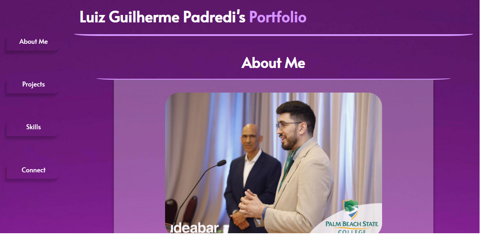
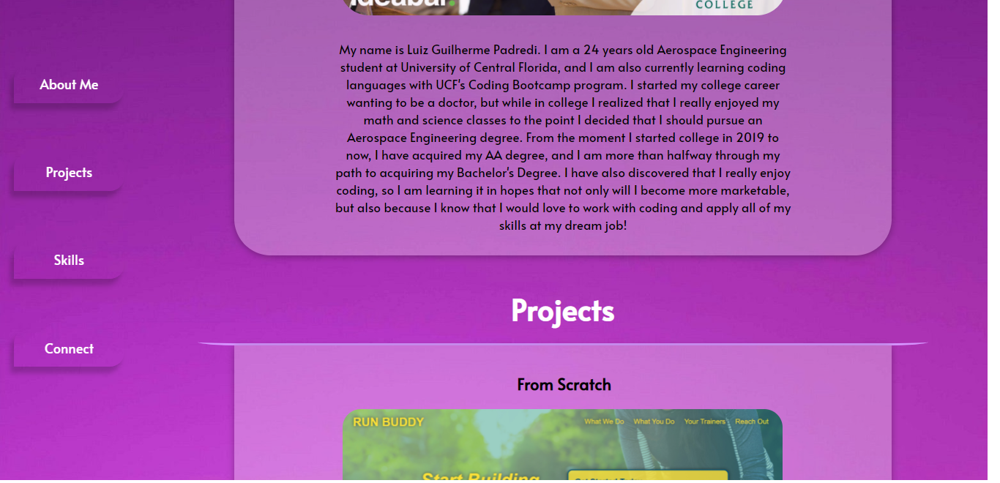
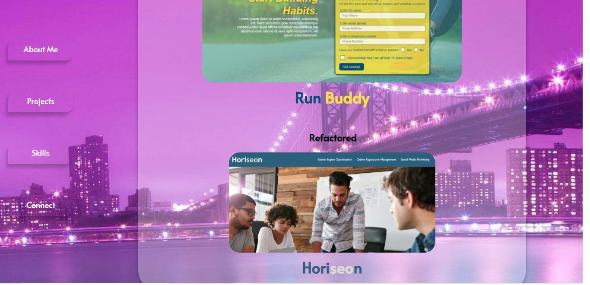
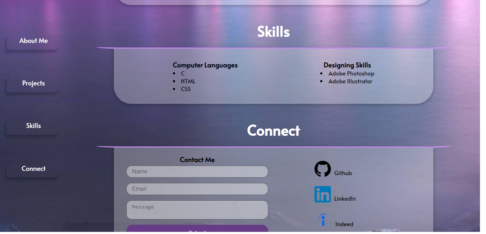
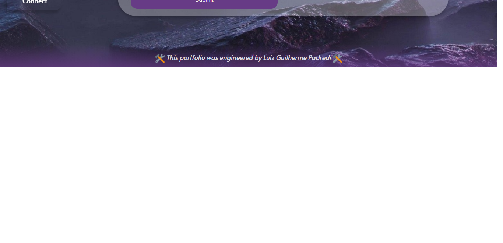

# Luiz Guilherme Padredi

# My-Portfolio :pencil:

## :label: Description
This is my first attempt at creating a personalized portfolio for myself.

## 	:hash: Coding Languages Used
:heavy_check_mark: HTML 
:heavy_check_mark: CSS 

## :desktop_computer: Website
Link to Website: https://padredilg.github.io/my-portfolio/
  
Screenshots from Website:

## :clap: Credits

:hammer_and_wrench: Created by Luiz Guilherme Padredi
